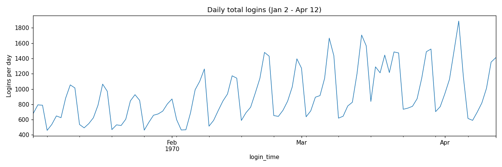
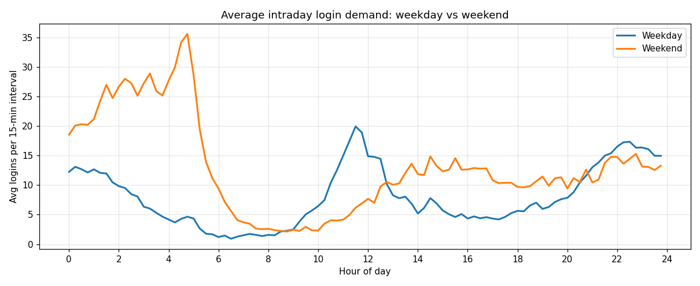
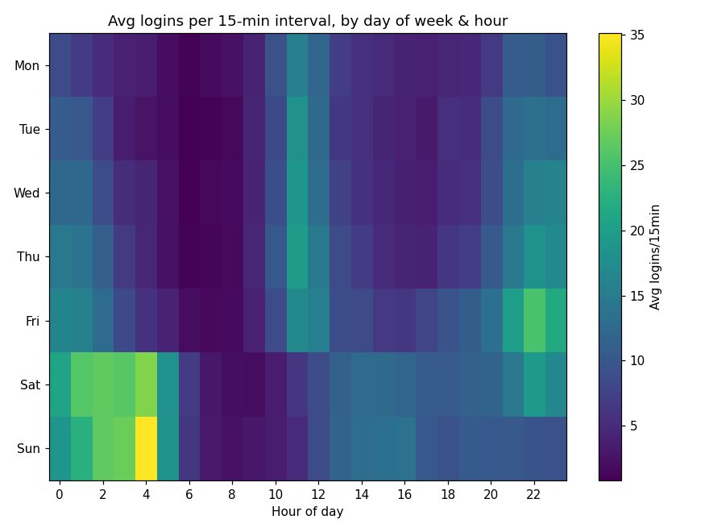
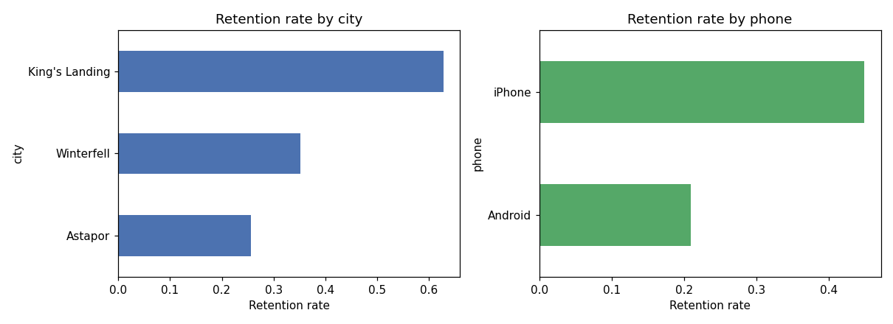
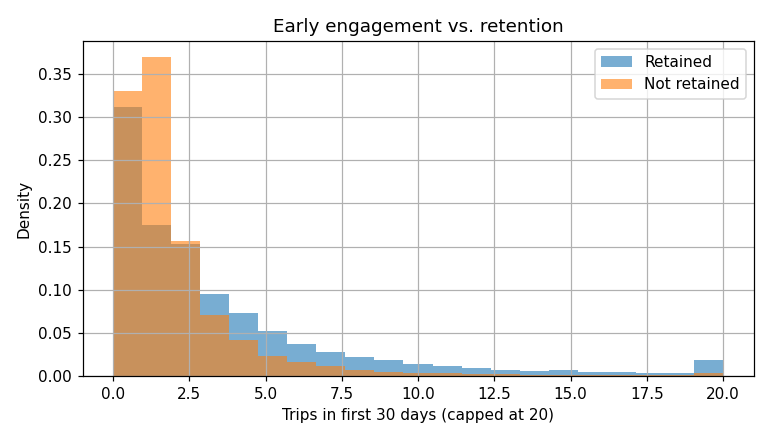
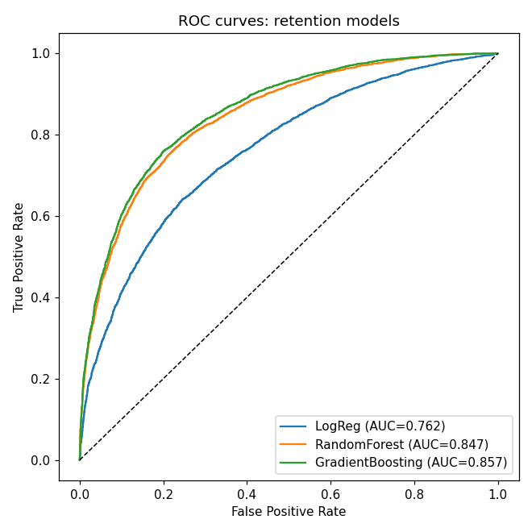
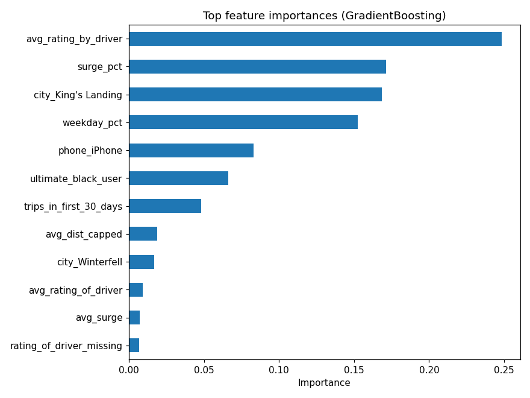

# Ultimate Technologies — Data Analysis Challenge

Solution to the three-part take-home: login-demand EDA, an experiment design for a
cross-city toll-reimbursement program, and a predictive model of rider retention.

```
repo/
├── README.md                        <- this file (full write-up)
├── part2_experiment_design.md       <- Part 2 answer (no code needed)
├── notebooks/
│   ├── part1_login_eda.ipynb        <- Part 1, executed
│   └── part3_retention_model.ipynb  <- Part 3, executed
├── images/                          <- exported charts, referenced below
└── data/                            <- logins.json, ultimate_data_challenge.json
```

---

## Part 1 — Login demand EDA

Full code and inline commentary: [`notebooks/part1_login_eda.ipynb`](notebooks/part1_login_eda.ipynb).

**Approach:** parse the 93,142 raw login timestamps, resample onto a fixed 15-minute grid
(9,788 intervals), then look at the series at three levels of resolution — daily totals,
average intraday shape, and a day-of-week × hour heatmap.

**Daily totals** show a clean 7-day cycle riding on top of a steady upward trend over the
~101 full days in the series (~700/day early on to ~1,400–1,900/day by the end):



**The weekday and weekend intraday shapes are almost mirror images of each other:**



- *Weekdays*: one broad midday peak (~11:00–12:00), a deep overnight trough (bottoms out
  ~06:30), and a secondary evening rise (21:00–23:00).
- *Weekends*: demand climbs from midnight and peaks around **04:45** (the single busiest
  15-minute slot of the week), then falls to the week's quietest stretch by 07:00–09:00 before
  slowly rebuilding through the day.



**Data quality issues found:**
- First and last calendar days are partial (data starts 20:12 on day 1, ends 18:57 on the final
  day) — excluded from daily-total analysis.
- No real calendar dates or timezone — timestamps are anonymized onto the Unix epoch, so the
  mid-series dip and the growth trend can't be tied to a specific date/holiday/weather event
  without more context from the source system.
- ~1.9% of logins share an exact-second timestamp with another login. Plausible by chance at
  this volume during busy periods, but worth a sanity check against the logging pipeline for
  duplicate/retried events.
- ~4% of 15-minute intervals have zero logins, concentrated almost entirely in the weekday
  early-morning trough — reads as genuine low demand, not a data gap.

---

## Part 2 — Experiment and metrics design

Full answer (metric choice, experiment design, statistical test, interpretation and caveats):
[`part2_experiment_design.md`](part2_experiment_design.md).

Short version: randomize toll reimbursement **at the driver-partner level**, stratified by home
city and pre-trial activity; measure the **share of partners completing a trip in both cities
in a given week**; analyze with a **difference-in-differences** model comparing each partner's
change from their own pre-trial baseline between treatment and control, with earnings/hour and
total trip volume tracked as guardrails.

---

## Part 3 — Predicting rider retention

Full code and inline commentary: [`notebooks/part3_retention_model.ipynb`](notebooks/part3_retention_model.ipynb).

### Cleaning, EDA, and retention rate

The data pull date is inferred as **2014-07-01** (the max `last_trip_date` in the file). A user
is "retained" if their `last_trip_date` falls in the 30 days before that, i.e. on/after
2014-06-01.

> **37.6% of the 50,000-user cohort was retained.**

Cleaning: imputed the small number of missing `phone` (0.8%) and rating fields (0.4% /
16.2% missing) with mode/median, keeping a missingness flag for `avg_rating_of_driver` since its
gaps aren't fully explained by zero trip volume; capped `avg_dist` at its 99th percentile
(160.96 mi max vs. 27.76 mi at p99) so the one heavy-tailed feature doesn't dominate the linear
model. `signup_date`/`last_trip_date` themselves were **excluded as model features** — the
target is derived directly from `last_trip_date`, so using it (or close derivatives) would leak
the answer.

City, phone OS, and early trip volume all show large gaps in raw retention rate and were
good candidate signals going into modeling:




### Model

Compared logistic regression (interpretable baseline) against random forest and gradient
boosting (handle non-linearities/interactions natively):

| Model | Accuracy | Precision | Recall | F1 | ROC-AUC |
|---|---|---|---|---|---|
| Logistic Regression | 0.720 | 0.672 | 0.501 | 0.574 | 0.762 |
| Random Forest | 0.782 | 0.761 | 0.613 | 0.679 | 0.847 |
| **Gradient Boosting** | **0.792** | 0.746 | 0.676 | **0.709** | **0.857** |



**Gradient boosting was carried forward** — best AUC and F1, and it's a small step from the
random forest with no added complexity. On a held-out 25% test set it hits 79.2% accuracy and
0.86 AUC. A 5-fold cross-validated AUC on the random forest (0.846 ± 0.004) is close to its
single-split score, so the result looks stable rather than an artifact of one split.

**Validity/concerns:**
- Recall on the retained class (0.68) is meaningfully lower than precision (0.75) — the model
  misses about a third of riders who actually come back. If the business use case is "target an
  intervention at likely-churning users," that asymmetry (and the cost of a false negative vs.
  false positive) should shape the classification threshold, not just the default 0.5 cutoff.
- Several top features (`avg_rating_by_driver`, `surge_pct`, `weekday_pct`) have importance that
  doesn't match their linear correlation with the target — the relationships are non-monotonic
  (see below), which is exactly the kind of pattern gradient boosting captures and logistic
  regression misses, and part of why the linear model underperforms here.
- This is an observational, not causal, model — the drivers below are correlational and
  shouldn't be read as "changing X causes retention to change" without a targeted experiment.

### What predicts retention



- **City** is the largest geography-level gap: **63% retention in King's Landing** vs. **35% in
  Winterfell** vs. **26% in Astapor** — likely reflects market maturity, competitive intensity,
  or service quality rather than anything about individual riders.
- **Phone OS**: iPhone users retain at **45%** vs. **21%** for Android — a large enough gap to be
  worth validating against platform-specific app quality or onboarding differences.
- **Surge exposure** is non-monotonic: retention is *highest* (~81%) for riders who saw a little
  surge pricing (0–10% of trips) and falls sharply for riders who saw a lot of it (~19% at
  50–100% of trips). Light surge exposure likely proxies for being a frequent, engaged rider;
  heavy exposure looks like a genuine price-sensitivity churn driver.
- **Weekday mix** is also an inverted-U: riders who mix weekday and weekend usage (50–75%
  weekday) retain best (~63%); riders who ride almost exclusively on weekends (~23%) or almost
  exclusively on weekdays (~30%) retain worse. Balanced, habitual use looks stickier than
  single-context use.
- **Early engagement** (`trips_in_first_30_days`) has a clean positive relationship with
  retention — consistent with an "aha moment"/habit-formation story.

### Suggestions for Ultimate

- **Double down on early engagement**: since first-30-day trip count is one of the more
  actionable (and linear) predictors, an onboarding push — a second-ride incentive, a
  time-limited discount — aimed at riders who haven't taken a 2nd/3rd ride yet could convert
  more of the ~31% of users who take zero trips in their first month.
- **Investigate the Android and Astapor/Winterfell gaps directly**: these are large, isolable
  gaps (not proxies for behavior) and worth a focused product/ops review — app performance on
  Android, and local market conditions in the lower-retention cities — before assuming they're
  unfixable.
- **Treat heavy surge exposure as a churn-risk signal**: riders who repeatedly hit high surge
  could be flagged for a targeted retention offer (e.g., a surge-protection credit) rather than
  waiting for them to churn.
- **Encourage habitual, multi-context use** rather than one-off weekend rides — e.g., a
  weekday-commute promotion aimed at weekend-only riders — since balanced usage is the strongest
  behavioral correlate of staying active.
- Any of these should be validated with a proper experiment (per the Part 2 framework) before
  being treated as causal — the model surfaces correlations, not proven levers.

---

## Notes

- All analysis in Python (pandas, scikit-learn, matplotlib); see notebooks for full code.
- Per the challenge instructions, `data/ultimate_data_challenge.json` should be deleted once
  the analysis is no longer needed.
